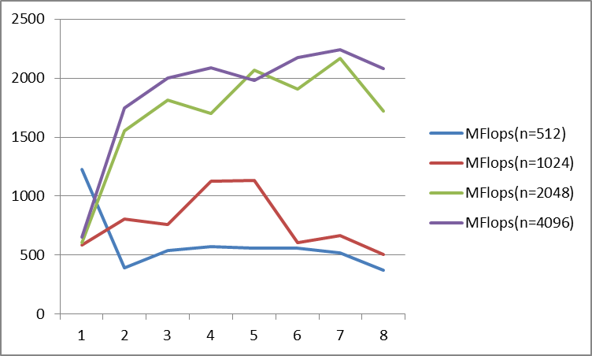

# TD1

`pandoc -s --toc README.md --css=./github-pandoc.css -o README.html`

## lscpu

*lscpu donne des infos utiles sur le processeur : nb core, taille de cache :*

```
Architecture:            x86_64
  CPU op-mode(s):        32-bit, 64-bit
  Address sizes:         39 bits physical, 48 bits virtual
  Byte Order:            Little Endian
CPU(s):                  4
  On-line CPU(s) list:   0-3
Vendor ID:               GenuineIntel
  Model name:            Intel(R) Core(TM) i7-7500U CPU @ 2.70GHz
    CPU family:          6
    Model:               142
    Thread(s) per core:  2
    Core(s) per socket:  2
    Socket(s):           1
    Stepping:            9
    BogoMIPS:            5807.99
Caches (sum of all):     
  L1d:                   64 KiB (2 instances)
  L1i:                   64 KiB (2 instances)
  L2:                    512 KiB (2 instances)
  L3:                    4 MiB (1 instance)
```


## Produit matrice-matrice

### Effet de la taille de la matrice

  n            | MFlops
---------------|--------
1024 (origine) | 249.22
1023           | 731.566
1025           | 545.196
2048           | 249.794
2047           | 274.71

*Expliquer les résultats.*

Quand n = 1024 (puissance de 2), les accès mémoire sont alignés et provoquent des conflits de cache, ce qui ralentit l'exécution.
En revanche, n = 1023 répartit mieux les accès dans la mémoire, réduisant les conflits et améliorant la performance.

Pourquoi ?
 n = 1024 → Accès mémoire réguliers, écrasement des lignes de cache, ralentissement.
 n = 1023 → Accès plus dispersés, moins de cache misses, exécution plus rapide

### Permutation des boucles

*Expliquer comment est compilé le code (ligne de make ou de gcc) : on aura besoin de savoir l'optim, les paramètres, etc. Par exemple : *
`make TestProductMatrix.exe && ./TestProductMatrix.exe 1024` *
Après on essaie pour 2048 avec:
* `./TestProductMatrix.exe 2048`* 
En concernant des flags du Makefile:
Les options de compilation sont définies avec CXXFLAGS 
-std=c++14 → Utilisation du standard C++14.
-march=native → Optimisation pour l'architecture du processeur local.
-Wall → Active les avertissements du compilateur.
-O3 ou -O2 → Optimisation du code (voir section ifdef DEBUG).
-g -O0 -D_GLIBCXX_DEBUG (si DEBUG=yes) → Désactive les optimisations (-O0), active le débogage et les vérifications supplémentaires sur les conteneurs STL (_GLIBCXX_DEBUG).


  ordre           | time  (n=1024) | MFlops(n=1024) | MFlops(n=2048)
------------------|----------------|----------------|----------------
i,j,k (origine)   |     14.8055    |   145.046      | 83.2216
j,i,k             |     14.0406    |   152.948      | 80.7032
i,k,j             |     56.8103    |   37.801       | 20.1350
k,i,j             |     64.2873    |   33.4045      | 15.4596
j,k,i             |     3.89603    |   551.198      | 542.506
k,j,i             |     10.120     |   1012.87      | 558.229


*Discuter les résultats.*
Les résultats nous montrent que, comme l'élément qui change le plus est `i`, ce sont les colonnes `j` et `k` qui sont stockées dans le cache et sont plus rapides à être accessibles par le processeur(mémoire contiguë).


### OMP sur la meilleure boucle

`make TestProductMatrix.exe && OMP_NUM_THREADS=1 ./TestProductMatrix.exe 512`
`./TestProductMatrix.exe 1024`
  OMP_NUM         | MFlops(n=512)  | MFlops(n=1024) | MFlops(n=2048)  |
------------------|---------|----------------|----------------|---------------
1                 |1227.73| 589.187| 607.135| 653.627
2                 |394.886| 807.905| 1556.49| 1748.9
3                 |538.87 |762.011 | 1811.11| 1997.31
4                 |571.906|1123.71 | 1698.66| 2087.59
5                 |561.62 |1132.33 | 2068.67| 1982.18
6                 |557.957|605.103 | 1907.01| 2173.05
7                 |520.116|665.956 | 2167.94| 2238.78
8                 |369.976|505.051 | 1720.42| 2077.48

*Tracer les courbes de speedup (pour chaque valeur de n), discuter les résultats.*


Pour de petites matrices (n=512), l'ajout de threads réduit la performance en raison de la surcharge de synchronisation. Pour des tailles plus grandes (n=1024, 2048, 4096), les performances augmentent avec le nombre de threads jusqu'à un seuil où la saturation du cache et de la bande passante mémoire entraîne une baisse. L'optimisation dépend du compromis entre l'utilisation efficace des cœurs et les limitations des accès mémoire.
On peut remarquer que, même si l'on augmente la capacité de calcul en augmentant le nombre de threads, la mémoire disponible par thread diminue, car la mémoire totale reste constante.

### Produit par blocs

`make TestProductMatrix.exe && ./TestProductMatrix.exe 1024`

  szBlock         | MFlops(n=512)  | MFlops(n=1024) | MFlops(n=2048)  |
------------------|---------|----------------|----------------|---------------
origine (=max)    |
32                |81.59  | 384.262|366.757
64                |55.5952|340.066 |529.559
128               |198.66 | 464.797| 982.252
256               |462.454| 1143.11| 1583.62
512               |564.598| 1332.57| 1904.73
1024              |546.397| 1140.37| 2113.38

*Discuter les résultats.*
L'utilisation de sous-blocs permet d'optimiser l'utilisation des caches, tout en facilitant un parallélisme efficace, ce qui peut améliorer considérablement la performance des calculs de produits de matrices, surtout pour des matrices de grande taille. En divisant mieux les matrices en sous-blocs, on évite les "cache misses" et on facilite le traitement de plusieurs blocs en parallèle grâce au parallélisme.


### Bloc + OMP


  szBlock  | OMP_NUM |MFlops(n=512)| MFlops(n=1024) | MFlops(n=2048)  | MFlops(n=4096)|
---------------|---------|---------|----------------|----------------|---------------|
1024           |  1      | 242.633 |1284.92         |721.409         |647.976        |
1024           |  8      | 581.123 |1500.84         |1716.13         |2160.17        |
512            |  1      | 478.284 |566.379         |617.49          |653.756        |
512            |  8      | 520.687 |1486.27         |2344.91         |2066.97        |

*Discuter les résultats.*

L'optimisation par sous-blocs couplée à l'utilisation de plusieurs threads améliore considérablement les performances de calcul de produits de matrices, en particulier pour des tailles de matrices grandes, où l'utilisation du cache et du parallélisme est essentielle

### Comparaison avec BLAS


  n            | MFlops
---------------|--------
512            | 359.145
1024 (origine) | 485.304
1023           | 609.516
1025           | 324.171
2048           | 504.062
2047           | 594.613


# Tips

```
	env
	OMP_NUM_THREADS=4 ./produitMatriceMatrice.exe
```

```
    $ for i in $(seq 1 4); do elap=$(OMP_NUM_THREADS=$i ./TestProductOmp.exe|grep "Temps CPU"|cut -d " " -f 7); echo -e "$i\t$elap"; done > timers.out
```
